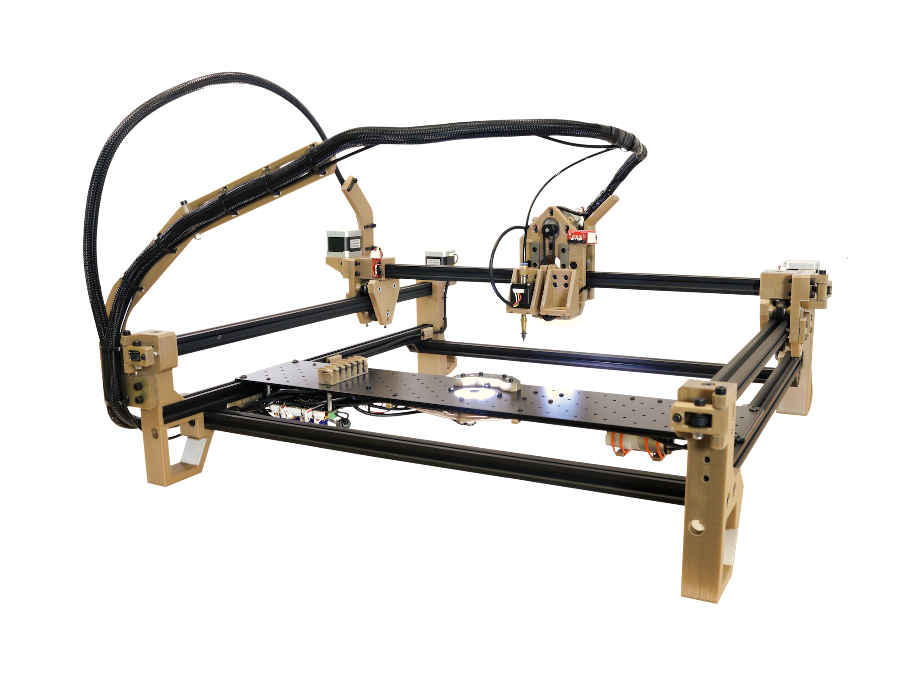

# LumenPnP
The LumenPnP is an open source [pick and place machine](https://en.wikipedia.org/wiki/Pick-and-place_machine) to aid in [Mid-Scale Manufacturing](http://stephenhawes.com/level-2-manufacturing/). 

LumenPnP kits are available for sale on the [Opulo Website](https://www.opulo.io/). Machines are being used in active production daily. If you build or buy one, please help the project by documenting bugs with a GitHub issue.

**Please [read the wiki here](https://github.com/index-machines/index/wiki)!** The wiki covers information about the state of the project, contributing instructions, and frequently asked questions.

The LumenPnP is designed to be low-cost enough that someone could buy or build one to support making production runs at home or as a small business. It runs using [OpenPnP](https://openpnp.org/).

Along with the pick and place machine itself, the project also includes feeders designed to work with the machine. Powered feeders are in the final design phase. Having a proven validated design is the next goal of the project.

The LumenPnP's development process is being cataloged in a series of videos. A playlist of these can be found [here](https://www.youtube.com/playlist?list=PLIeJXmcg1baLBz3x0nCDqkYpKs2IWGHk4).

## How do I build one?
You can buy a kit on the [Opulo Website](https://www.opulo.io/products/lumenpnp-kit) and follow the build instructions on the [docs page](https://docs.opulo.io/)!

## Contributing
If you would like to contribute to the project, awesome! Check out the [contributing page](https://github.com/index-machines/index/wiki/Contributing) to get started.

## Community
Discussion about the project happens on the [STR Discord server](https://discordapp.com/invite/TCwy6De)!

