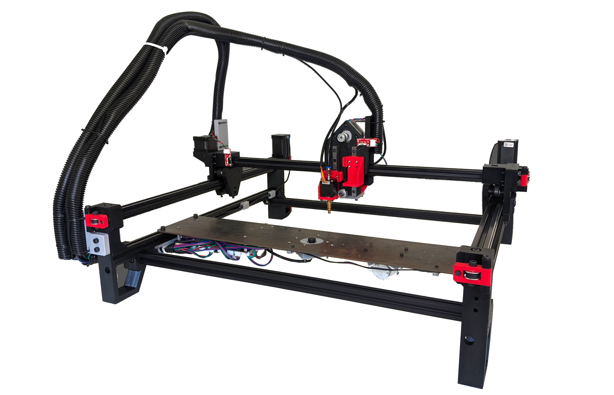

# Index PnP
The Index Pick and Place is an open source pick and place machine to aid in [Mid-Scale Manufacturing](http://stephenhawes.com/level-2-manufacturing/). 

We have hit our v2.0.0 release, so we can now officially recommend folks build one for themselves! Machines are being used in active production daily. If you decide to build one, please help find bugs and design issues by submitting GitHub issues.

**Please [read the wiki here](https://github.com/index-machines/index/wiki)!** The wiki covers information about the state of the project, contributing instructions, and frequently asked questions.

The Index is designed to be low-cost enough that someone could buy or build one to support making production runs at home or as a small business. It runs using OpenPnP. The Index will eventually be able to do multiple parts of the PCBA manufacturing process. It is currently capable of picking parts and placing them, but eventually the Index will support solder paste dispensing and interfacing with other machines, such as a PCB panel hopper and reflow oven. 

Along with the Index machine itself, the project also includes feeders designed to work with the Index. Although they were designed with the Index in mind, they can work with any OpenPnP pick and place with a 20mm x 20mm rail for mounting.

The Index's development process is being cataloged in a series of videos. A playlist of these can be found [here](https://www.youtube.com/playlist?list=PLIeJXmcg1baLBz3x0nCDqkYpKs2IWGHk4).

## How do I build one?
You can build one for yourself by following our build instructions on the [docs page](https://docs.opulo.io/)!

## Contributing
If you would like to contribute to the project, awesome! Check out the [contributing page](https://github.com/index-machines/index/wiki/Contributing) to get started.

## Community
Discussion about the project happens on the [STR Discord server](https://discordapp.com/invite/TCwy6De)!

