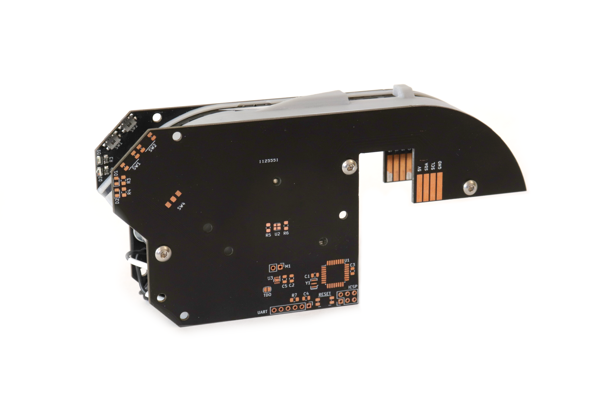

# Index Feeder

The Index Feeder is a pick and place feeder that is designed to work with 8mm, 12mm, 16mm, or 24mm component tape. It communicates over RS-485, and interfaces with the Piggyback board.

All versions of the Index Feeder use the same PCB design. This PCB handles communication over RS-485, motor control, positioning, detecting tape runout, and a small UI including two buttons and two LEDs. The microcontroller onboard is the ATMEGA328P, not only for its ubiquitous usage in the hobbyist world (and therefore excellent documentation and accessibility), but also for its ideal specifications for this application.

One of these PCBs gets populated and acts as the left structural panel of the feeder, while a second, unpopulated pcb is purely used as the right structural panel. They're mounted together with 30mm M3 standoffs. The point at which feeders differ to accomodate different sized tape is with the printed tape guides that attach to the PCBs.

The tape is indexed forward using an indexing wheel attached to the DC motor. This indexing wheel is actually a PCB with teeth cut along the circumference. This PCB also has small windows cut in it, and has the stokes between these windows plated with gold (ENIG coating). This alternating window/gold plating acts as a form of encoder in conjunction with a VCNT2020 reflective sensor mounted to the PCB. With a bit of signal processing, the output from this sensor can measure how far forward the tape has moved and allow for precise tape positioning.

The motherboard PCB for the feeder should be a 1.6mm thick board, and the indexing wheel PCB should be 1.0mm thick, with ENIG plating and the darkest soldermask available, ideally matte black.
